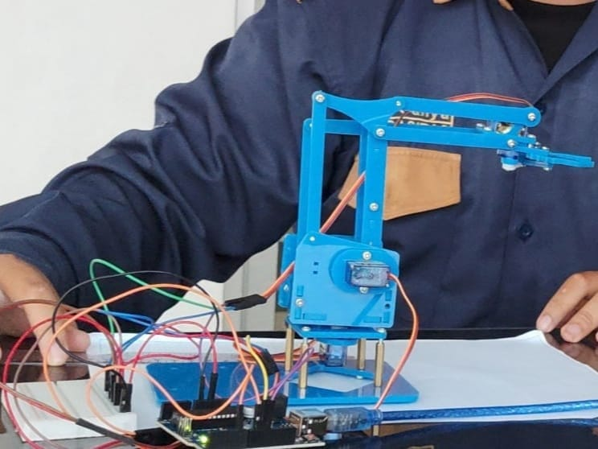

# Arduino Robot Arm Controller

Pengendali robot arm berbasis Arduino dengan 4 derajat kebebasan (DOF) sederhana.

## Fitur

- Kontrol 4 servo motor (YAW, DOF1, DOF2, dan CLAW)
- Antarmuka serial sederhana untuk pengendalian
- Kalibrasi posisi otomatis
- Preset gerakan untuk demonstrasi

## Spesifikasi Hardware

- Arduino (UNO atau kompatibel)
- 4 Servo Motor
- Suplai daya yang memadai untuk servo
- Struktur arm robot

## Pengkabelan

| Servo | Pin Arduino |
|-------|------------|
| YAW   | D6         |
| DOF1  | D9         |
| DOF2  | D10        |
| CLAW  | D11        |

## Penggunaan

Upload program ke Arduino dan buka Serial Monitor dengan baudrate 9600. Kirim angka berikut untuk mengendalikan robot:

| Perintah | Aksi           | Deskripsi                        |
|----------|----------------|----------------------------------|
| 1        | Yaw Left       | Memutar base ke kiri             |
| 2        | Yaw Right      | Memutar base ke kanan            |
| 3        | Yaw Normal     | Mengembalikan base ke posisi awal|
| 4        | DOF1 Back      | Menggerakkan joint 1 ke belakang |
| 5        | DOF1 Normal    | Mengembalikan joint 1 ke posisi normal |
| 6        | DOF2 Down      | Menurunkan joint 2               |
| 7        | DOF2 Normal    | Mengembalikan joint 2 ke posisi normal |
| 8        | Claw Open      | Membuka pencapit                 |
| 9        | Claw Close     | Menutup pencapit                 |
| 0        | Calibrate      | Kalibrasi semua servo ke posisi default |

## Kode Rahasia

Program ini memiliki kode rahasia yang dapat digunakan:
- 5146752246753046760 -- flexing mode
- 1569 -- demo mode

## Lisensi

MIT License

## Kontributor

[Hanif Nugraha] - [hanifnugrahaa]
[Devan Cahya] - [hanifnugrahaa]
[Bagus Ananta] - [hanifnugrahaa]
